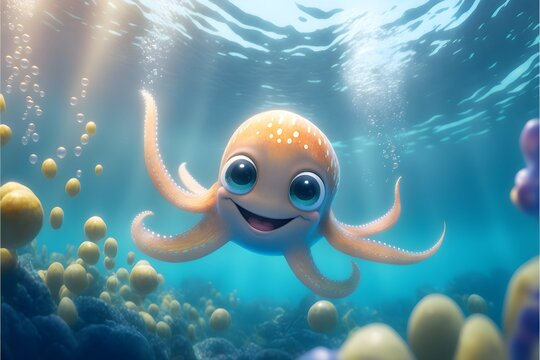

---
# **This is Harprit Khakh**
*A short Introduction of Harprit*
---

## What year is Harprit in and what is her major?
 Harprit has already completed her Bachelor of Science in Biological Sciences 

## Why did Harprit enroll in this course? 
Harprit wants to go on to do graduate studies in Neuroscience to study consciousness. Programming and scientific computing/data analysis skills are an essential part of the toolkit of any aspiring neuroscientist! 

## What got you interested in neuroscience/or psychology? 
The mind! Especially consciousness! How does the 1.5ish kg mass of white and grey matter inside our craniums bring out our subjective experience??

## What are Harprit's career plans? 
Harprit wants to become a neuroscientist and help find methods to measure one's level of consciousness, determine the quality of conscious experience and map out the landscape of possible conscious experiences that can be had by humans as well as non-humans. 